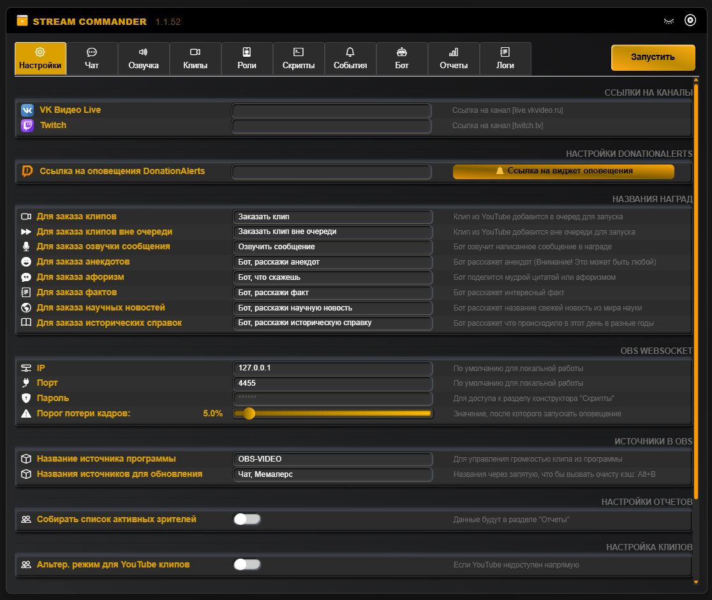
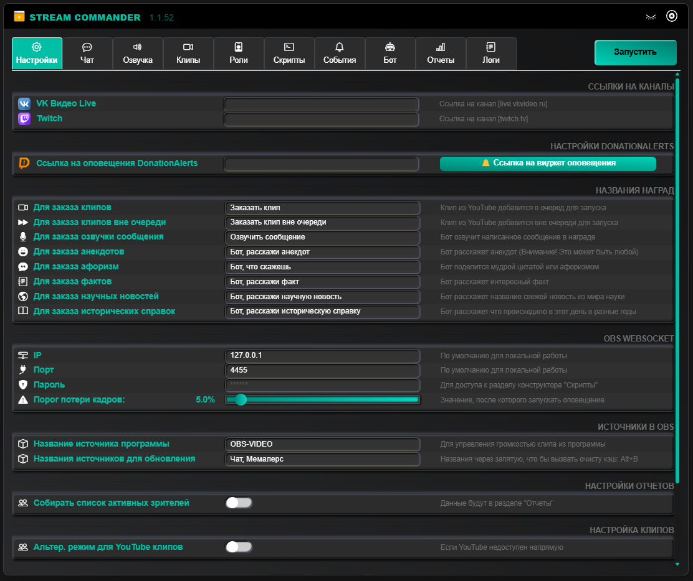
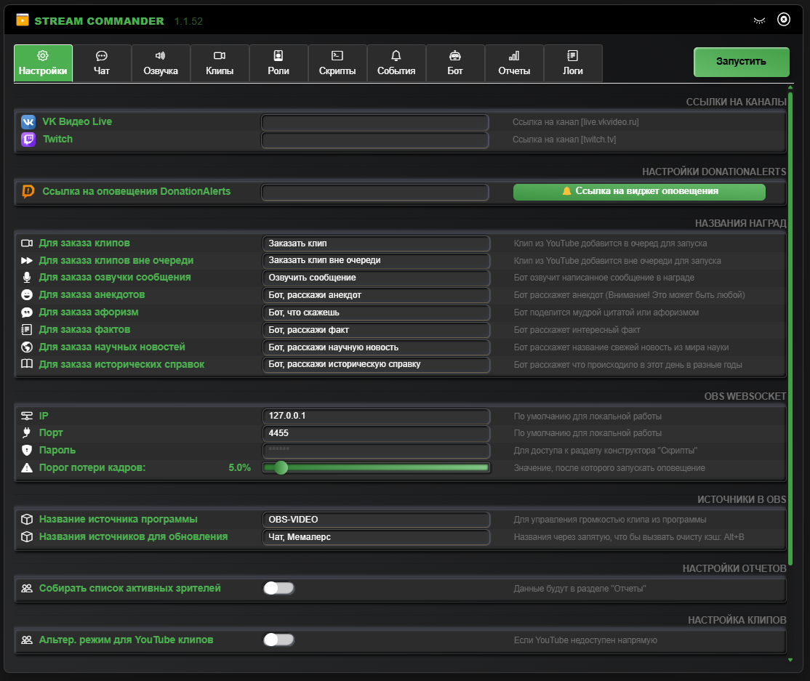
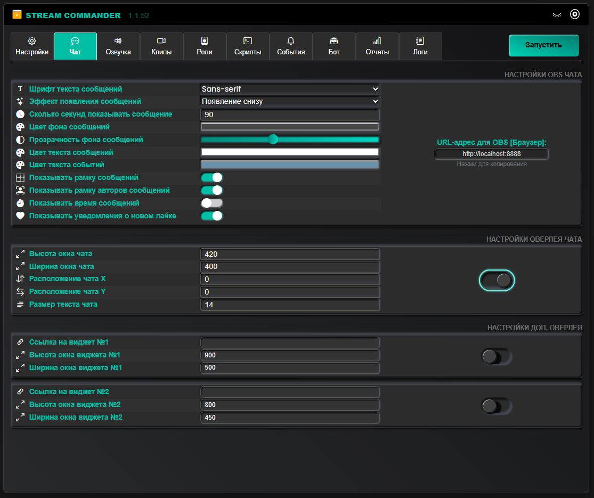
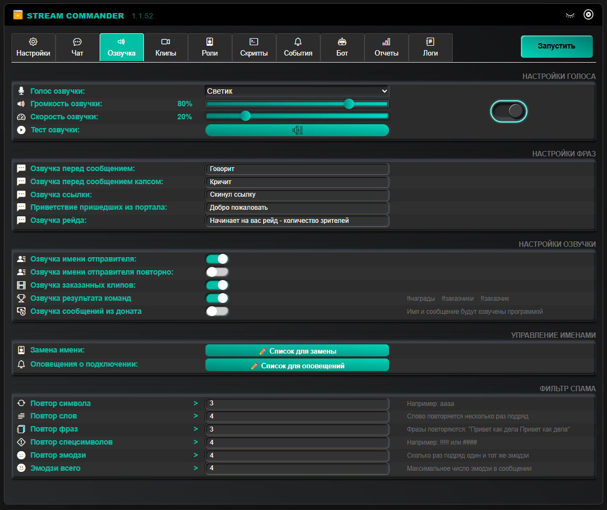
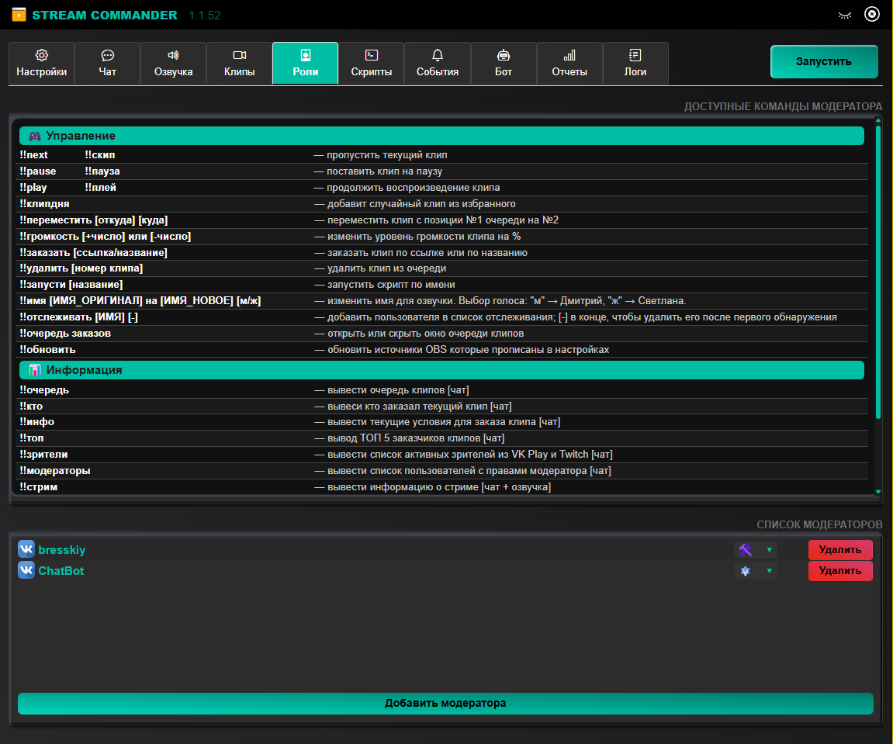
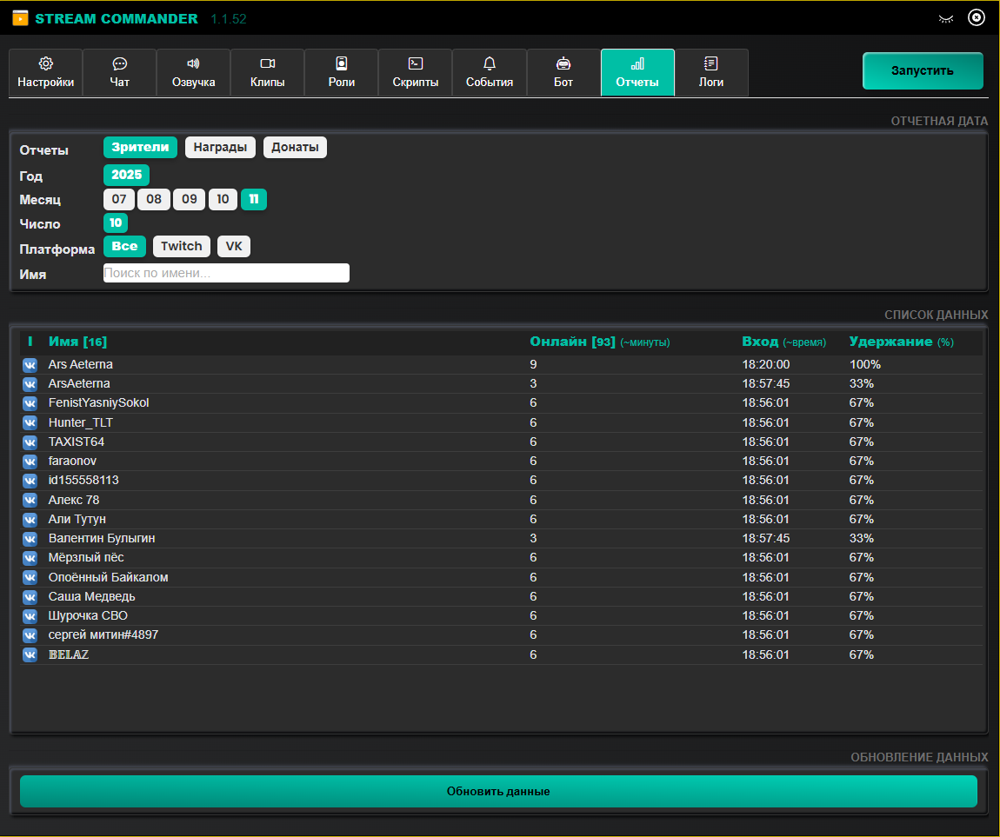
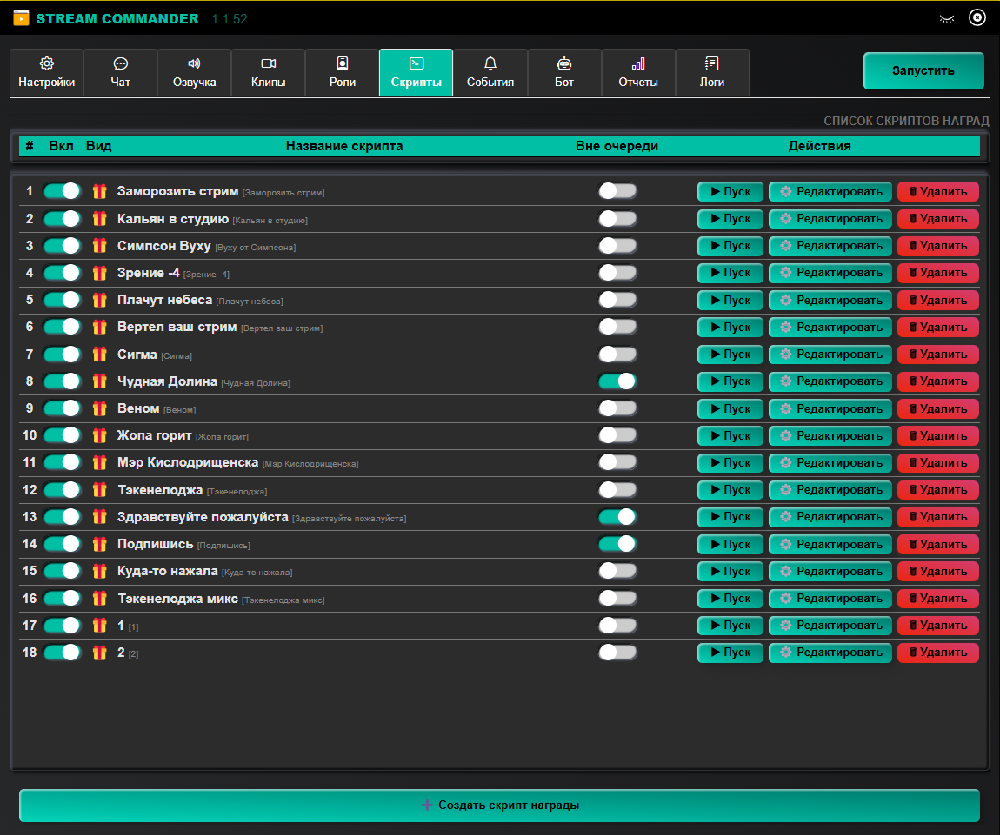

# Stream Commander

## 📌 Что это?

**Stream Commander** — это мощный инструмент для стримеров, который автоматизирует взаимодействие с чатом, обработку донатов, заказов видео и интеграцию с OBS. Он делает эфиры динамичными, интерактивными и удобными.

---
 

## ✨ Основные возможности

| Функция                                    | Что умеет                                                                                                   |
|--------------------------------------------|-------------------------------------------------------------------------------------------------------------------|
| 🔊 **Озвучка чата и событий**  | Автоматически озвучивает сообщения чата VK и Twitch Озвучивает донаты, награды, системные уведомления Кастомные голоса, скорость речи, свои фразы Конвертация валют в донатах для правильных сумм |
| 🎬 **Заказы видео и клипов**   | Принимает заказы с YouTube — по ссылке или по названию через API Принимает заказы с VK Video Фильтры по длительности и количеству просмотров Общая очередь с приоритетами и возможностью «вне очереди» Кэширование видео для мгновенного воспроизведения |
| 💸 **DonationAlerts**          | Мгновенный мониторинг виджета в реальном времени Автоматическая конвертация USD, EUR, KZT и других валют в RUB Реакции на донаты: озвучка, сообщения в чат, скрипты OBS |
| 🏆 **Наград и событий**        | Реакции на подписки, рейды, фолловы, реварды, порталы Скрипты: озвучка, сообщения и все функции скриптом для OBS |
| 👥 **Мониторинг зрителей**     | Сбор списка активных зрителей с Twitch и VK Live Уведомления о появлении особых пользователей (опции) Фильтры чата: по длине сообщения, таймауты, лимиты |
| 🎮 **Интеграция с OBS**        | Управление сценами, источниками и фильтрами через WebSocket Мониторинг времени стрима, дропов кадров, переподключений Уведомления о проблемах в чат и через TTS |
| ⚙️ **Скрипты**             | Создание полностью кастомных скриптов на любые события Переключение фильтров, громкости, источников и сцен Задержки, комбинации, очередность и т.д.|
| ⌨️ **Горячие клавиши**         | Быстрое управление во время стрима: Пауза/пропуск клипа ∙ вкл/выкл TTS ∙ регулировка громкости Обновление источников ∙ показ очереди ∙ повторная озвучка ∙ многое другое |
| 📊 **Отчёты и аналитика**      | Сохранение всех данных в JSON: зрители, донаты, награды Удобные фильтры по дате и платформе Экспорт подробных отчётов |
| 🎨 **Кастом и доп фичи**       | 14 встроенных цветовых тем Оверлеи для чата ∙ кэширование TTS ∙ шутки, афоризмы и факты Поддержка туннелирования Кастомные размеры окон, зум, автоматическая очистка кэша |

 

---

## 🖼 Скриншоты

  

  
**Чат и озвучка**  
 

  
**Роли и отчёты**  
 

  
**Скрипты и события**  
 

 

**Готовы к следующему уровню стриминга?**  

 

---

## 📦 Установка

1. Скачайте установщик
2. Запустите его — установка проходит без необходимости прав администратора
3. Запустите `StreamCommander.exe` на рабочем столе

---

## 💬 Поддержка и сообщество

- Telegram: [@StreamCommander](https://t.me/StreamCommander)

---

## ⚠️ Сертификат

Цифровой подписи не будет - а значит для Windows 'Издатель неизвестен'.

---

## 📄 Лицензия

Apache-2.0 license
